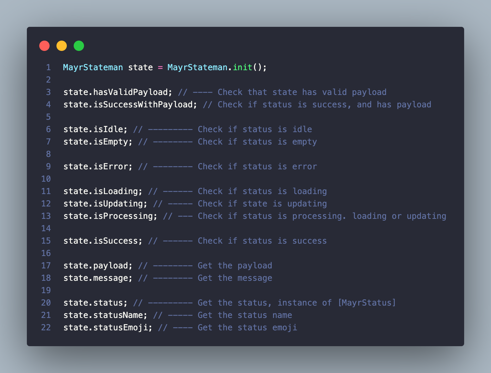

# 🚦 Mayr StateMan
*A lightweight and intuitive state utility for Dart.*


`mayr_stateman` provides an easy way to manage and track the status of any operation.

Whether loading, updating, succeeding, or failing, mayr_stateman keeps your state transitions clean and predictable — without heavy dependencies or boilerplate.

## ✨ Features
- Simple, lightweight state management for Dart projects (and Flutter apps too).

- Easily manage statuses like idle, loading, success, error, updating, and empty.

- Fluent API for chaining multiple state updates elegantly.

- Built-in support for attaching payloads and messages to your states.

- Handy getters like isLoading, isSuccessWithPayload, hasValidPayload, and more.

- Zero dependency — pure Dart, clean and fast.

- Designed for both frontend UI state and backend logic scenarios.

## 🚀 Getting started

1. Add `mayr_stateman` to your `pubspec.yaml`:

    ```yaml
    dependencies:
        mayr_stateman: # check for the latest version on pub.dev
    ```

2. Instal the package:
    ```bash
    flutter pub get
    ```

3. Import it into your Dart file:
    ```dart
    import 'package:mayr_stateman/mayr_storage.dart';
    ```

> Alternatively, you could install it using the command
> ```bash
> flutter pub add mayr_stateman
> ```


## Usage

To use `MayrStateman`, you simply need to create an instance of it.

The `MayrStateman` class is generic, which means you can define a payload type that it will hold.

> For example, if you want to track the state of a network request with a payload of type String, you can do the following:
> ```dart
> MayrStateman<String> state = MayrStateman<String>.init();
>```

### Setting and Getting State

You can easily manage the state with various setter methods and retrieve the current state with getter methods:

```dart
MayrStateman<String> state = MayrStateman<String>.init();

// Setting state to loading
state.setStatusLoading();

// Setting a message
state.setMessage('Fetching data...');

// Setting state to success with a payload
state.setSuccessWithPayload('Success!');

// Checking if state is success with valid payload
if (state.isSuccessWithPayload) {
  print('Payload: ${state.payload}');
}
```

### Resetting the State

You can reset the state back to idle with:
```dart
state.reset();
```
This resets the state to idle, clears any message, and removes the payload.

### Using the Emoji Getter for State

For a more user-friendly experience, you can easily access emojis representing the current state. For example:
```dart
StateUtil<String> state = StateUtil<String>.init();

// Setting the state to error
state.setErrorWithMessage('An error occurred');

// Accessing emoji for the current state
print('Current State Emoji: ${state.statusEmoji}');

// This would output:
// Current State Emoji: ❌
```

## Cheetsheet

### Getters


### Setters


### MayrStatus

The package also exposes the status enum it uses.
```dart
enum MayrStatus { empty, error, idle, loading, success, updating }
```
The status can be accessed from the stateman using
```dart
state.status;
```
And it exposes an `status.emoji` property.

| Status                | Emoji |
| --------------------- | ----- |
| `MayrStatus.empty`    | 📭     |
| `MayrStatus.error`    | ❌     |
| `MayrStatus.idle`     | ⏸️     |
| `MayrStatus.loading`  | ⏳     |
| `MayrStatus.success`  | ✅     |
| `MayrStatus.updating` | 🔄     |

## 📢 Additional Information

### 🤝 Contributing
Contributions are highly welcome!
If you have ideas for new extensions, improvements, or fixes, feel free to fork the repository and submit a pull request.

Please make sure to:
- Follow the existing coding style.
- Write tests for new features.
- Update documentation if necessary.

> Let's build something amazing together!

---

### 🐛 Reporting Issues
If you encounter a bug, unexpected behaviour, or have feature requests:
- Open an issue on the repository.
- Provide a clear description and steps to reproduce (if it's a bug).
- Suggest improvements if you have any ideas.

> Your feedback helps make the package better for everyone!

---

### 📜 Licence
This package is licensed under the MIT License — which means you are free to use it for commercial and non-commercial projects, with proper attribution.

> See the [LICENSE](LICENSE) file for more details.

---

## 🌟 Support

If you find this package helpful, please consider giving it a ⭐️ on GitHub — it motivates and helps the project grow!

You can also support by:
- Sharing the package with your friends, colleagues, and tech communities.
- Using it in your projects and giving feedback.
- Contributing new ideas, features, or improvements.

> Every little bit of support counts! 🚀💙
